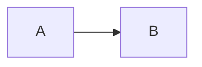

# Knowledge Markdown

Import and export OCA Knowledge pages (`document.page`) as Markdown in Odoo 19.

## What it does

- Create a new Knowledge page directly from a UTF-8 `.md` or `.markdown` file.
- Import a Markdown file into an existing saved Knowledge content page as a new revision.
- Export the current saved Knowledge content page as a `.md` file.
- Preserve common Markdown structures: headings, emphasis, links, images, lists,
  blockquotes, tables, inline code, horizontal rules, and fenced code blocks.
- Preserve fenced code-block language identifiers.
- Convert Mermaid fences to Odoo syntax-highlighted code blocks using the
  `mermaid` language id. If a Mermaid renderer addon is installed, it can render
  the block; otherwise the source remains a normal code block.

The Markdown conversion engine is kept separate from the Knowledge UI integration
so it can be reused by future addons without placing Markdown controls throughout
Odoo's global HTML editor.

## Compatibility

- Odoo 19
- OCA `document_page` 19.0
- Python 3.10+
- Python package `Markdown>=3.5,<4`

This addon is intentionally independent of Automatify infrastructure and does not
require any Automatify service, account, API key, or deployment setup.

## Installation

1. Install the OCA `document_page` addon and its dependencies.
2. Install the Python dependency:

   ```bash
   pip install "Markdown>=3.5,<4"
   ```

3. Put `knowledge_markdown` on an Odoo addons path.
4. Update the Apps list and install **Knowledge Markdown**.

## Usage

### Create a page from Markdown

Open the Knowledge **Pages** list, open the cog menu, and choose **Import Markdown**.
It is placed next to Odoo's standard **Import records** entry so Markdown import is
available from the same area without changing Odoo's generic CSV/XLSX importer.
Choose a category and a `.md` or `.markdown` file. The title field is optional:
when it is empty, the importer uses the first level-one Markdown heading
(`# Heading`) and falls back to the file name. The newly created page opens after
import.

Odoo's standard **Import records** action remains unchanged for tabular CSV/XLSX
record imports. Markdown is handled by a Knowledge-specific importer because a
Markdown document maps to page content rather than to the generic column/field
mapping used by Odoo's record importer.

### Update an existing page

On a saved content page, the compact **Import Markdown** action imports a file as a
new `document.page.history` revision. **Export Markdown** downloads the current
page as UTF-8 Markdown. These page-level actions are hidden until the record has
been saved, avoiding invalid actions on an unsaved page.

Imports are limited to 2 MiB and are sanitized before being stored.

There is deliberately no global enable/disable setting in the first release. The
feature is available when the addon is installed, and its actions appear only in
contexts where they are valid.

## Mermaid round-trip

Input:

````markdown

````

Stored in Odoo as a syntax-highlighting code block with
`data-language-id="mermaid"`.

Exporting the page recreates the `mermaid` fenced code block. Rendering is not
part of this addon.

## Scope of the first release

The first release handles one Knowledge page per Markdown file. It does not yet
export/import page trees, ZIP archives, attachments, or rewrite relative links
between multiple pages.

## Security

Markdown is converted to HTML and passed through Odoo's HTML sanitizer before it
is written to page history. Export routes require an authenticated user and check
read access to the requested page. Creating a page from Markdown uses the current
user's normal Odoo create and category access rights.

## License

AGPL-3.0-or-later. This matches the license requirements of the OCA
`document_page` dependency.

Copyright 2026 Automatify Pty Ltd.
