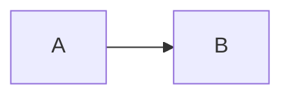

# Knowledge Markdown

A self-contained Markdown knowledge workspace for Odoo 19.

## What it does

- Create categories and editable knowledge pages directly in Odoo.
- Create a new page from a UTF-8 `.md` or `.markdown` file.
- Import Markdown into an existing page as a new revision.
- Export the current saved page as a `.md` file.
- Preserve common Markdown structures: headings, emphasis, links, images, lists,
  blockquotes, tables, inline code, horizontal rules, and fenced code blocks.
- Preserve fenced code-block language identifiers, including Mermaid.

The addon owns its page and revision models. It does **not** depend on OCA
`document_page` or `document_knowledge`. Markdown conversion and upload validation
come from the reusable `automatify_markdown` technical addon.

## Compatibility

- Odoo 19
- Python 3.10+
- Python package `Markdown>=3.5,<4`

## Installation

1. Install the Python dependency:

   ```bash
   pip install "Markdown>=3.5,<4"
   ```

2. Put `automatify_markdown` and `knowledge_markdown` on an Odoo addons path.
3. Update the Apps list and install **Knowledge Markdown**. Odoo installs **Markdown Core** automatically.

No OCA repository or third-party Odoo addon is required.

## Usage

### Create categories

Open **Knowledge Markdown → Categories** and create one or more categories.

### Create a page from Markdown

Use **Knowledge Markdown → Import Markdown**, choose a category and a `.md` or
`.markdown` file. The title field is optional: when empty, the importer uses the
first level-one Markdown heading (`# Heading`) and falls back to the file name.

You can also open **Knowledge Markdown → Pages** and use **Import Markdown** from
the list cog menu.

### Edit or update an existing page

Open a page and edit its HTML content directly, or click **Import Markdown** to
replace the saved content from a Markdown file. Every Markdown import creates a
revision entry with its author, timestamp, name, and summary.

### Export Markdown

Open a saved page and click **Export Markdown**. The current page content is
downloaded as UTF-8 Markdown.

Imports are limited to 2 MiB and converted HTML is sanitized by Odoo before it is
stored.

## Mermaid round-trip

Input:

````markdown

```mermaid
flowchart LR
A --> B
```
````

The page stores the block with the `mermaid` language id. Exporting recreates the
Mermaid fenced code block. Rendering Mermaid diagrams is intentionally outside
this addon's scope.

## Upgrade note

Version `19.0.2.0.0` replaces the former OCA `document_page` integration with
Automatify-owned page and revision models. Existing OCA `document.page` records
are not migrated automatically because they belong to a separate third-party
module.

## Security

Pages, revisions, and import wizards are available to authenticated internal
users. Export routes require authentication and enforce normal Odoo read access.
Markdown is converted to HTML and sanitized before storage.

## License

AGPL-3.0-or-later.

Copyright 2026 Automatify Pty Ltd.
